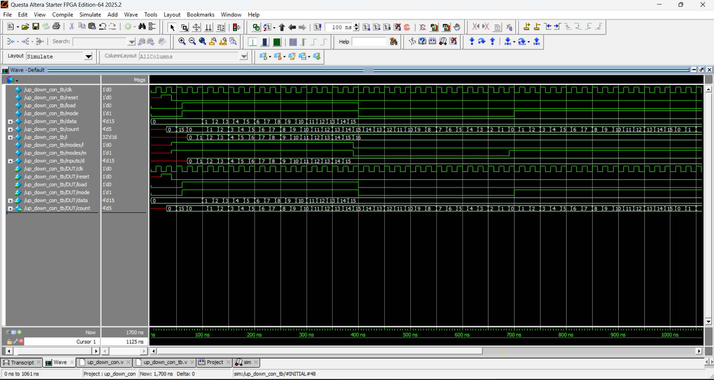
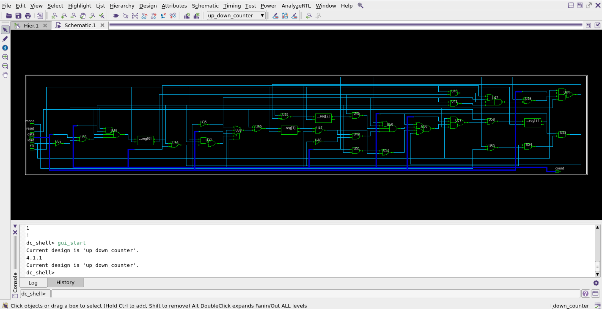

# 4-BIT UP_DOWN_COUNTER_PROJECT

## 📂 Project Structure
- **rtl**  : Verilog RTL design 
- **tb**   : Task-based testbench
- **docs** : Waveform and synthesis results (schematic view)

## ⚙️ Design Specifications
- **Inputs**  : clk, reset, load, mode, data
- **Outputs** : count[3:0] (4 bits)  
- **Working** : When the load is high the data which we are assigning will be assigned to count when load is low according to the mode the count will be make the operation which can be increment or decrement. When mode is high it Increments from 0 to 15, then goes over to 0. Reset clears the counter to 0.
  When mode is low it Decrements from 15 to 0.

## 📊 Results
- **Waveform** :   
- **Synthesis** : 

## 🧪 How to Run
1. Compile RTL and testbench using your simulator (e.g., Icarus Verilog, ModelSim, or QuestaSim).  
2. Run simulation to generate `up_counter.vcd`.  
3. Open `.vcd` in GTKWave to view waveform.  
4. Run synthesis in Synopsys DC (`dc_shell`) to generate schematic.

**Note**: `.vcd` files are for GTKWave users. ModelSim/QuestaSim users can view the built‑in `.wlf` waveform directly.
