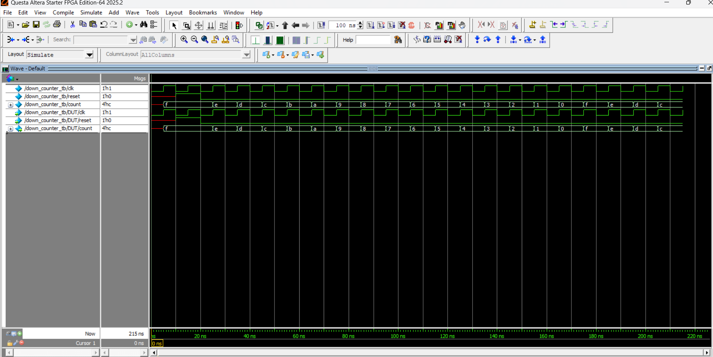
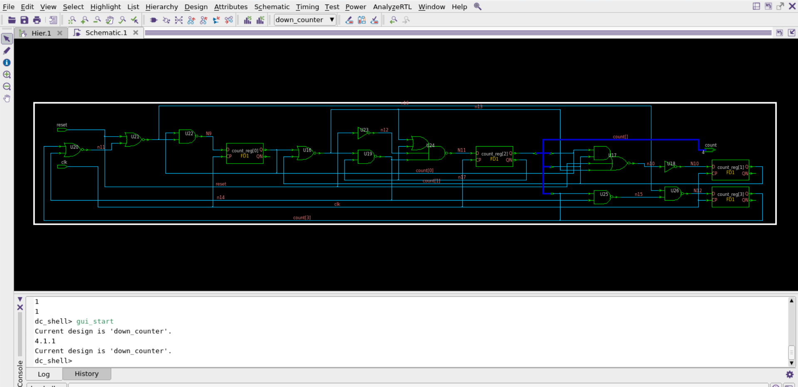

# 4-BIT DOWN_COUNTER_PROJECT

## 📂 Project Structure
- **rtl**  : Verilog RTL design 
- **tb**   : Task-based testbench
- **docs** : Waveform and synthesis results (schematic view)

## ⚙️ Design Specifications
- **Inputs**  : clk, reset  
- **Outputs** : count[3:0] (4 bits)  
- **Working** : Increments from 15 to 0, then goes over to 15. Reset clears the counter to 15.

## 📊 Results
- **Waveform** :   
- **Synthesis** : 

## 🧪 How to Run
1. Compile RTL and testbench using your simulator (e.g., Icarus Verilog, ModelSim, or QuestaSim).  
2. Run simulation to generate `up_counter.vcd`.  
3. Open `.vcd` in GTKWave to view waveform.  
4. Run synthesis in Synopsys DC (`dc_shell`) to generate schematic.

**Note**: `.vcd` files are for GTKWave users. ModelSim/QuestaSim users can view the built‑in `.wlf` waveform directly.
